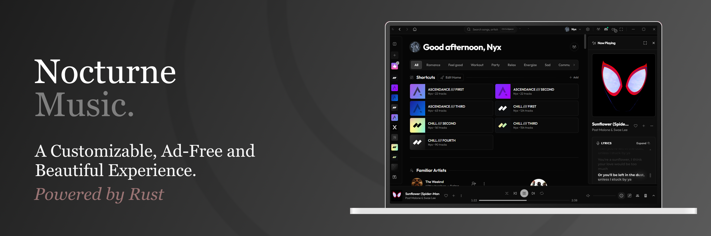

<div align="center">



# Nocturne Music

**A native desktop YouTube Music client — Rust + Tauri, ad-free, no Electron.**

<p align="center">
  
  
  
  
</p>

**Nocturne Music** talks directly to YouTube's internal API and plays audio through libmpv — no bundled
browser runtime, no backend server, no ads in the audio and **Extremely Customizable**. Started as a fork of [Limusic](https://github.com/SimoHypers/limusic) and was built from that to my taste and hopefully others' tastes too. [Limusic](https://github.com/SimoHypers/limusic) itself started as a desktop rebuild of the playback engine behind [Metrolist](https://github.com/mostafaalagamy/Metrolist), an Android YouTube Music client, and grew from there.

</div>

---

## Features

- **Ad-free playback** — streams come straight from YouTube's API, ads never do
- **Search & browse** — songs, albums, artists, playlists, and the YTM home feed
- **Sign in** with your YouTube Music account: in-app Google login or cookie-paste
- **Your library** — playlists, liked songs, and write actions (like, add to playlist, create/rename/delete playlists, subscribe)
- **Gapless playback** with loudness normalization, powered by libmpv
- **Queue** with radio/automix continuation, restored across restarts
- **Synced lyrics & Glassy Turbo** — ultra-fluid lyrics with luminous syllable glow, soft defocusing inactive lines, smooth spring-inertia auto-scroll, and per-song BetterLyrics sync offset tuning
- **BetterLyrics Sync Dock** — on-the-fly lyrics sync offset tuner (`[-0.5s]`, `[-0.1s]`, `[+0.1s]`, `[+0.5s]`, reset) integrated into Info Sidebar, Fullscreen Player, and Lyrics Panel
- **Playlist Folders & Drag-and-Drop** — organize your playlists into expandable sidebar folders with drag-and-drop support
- **Rich Playlist Creation** — set custom cover artwork, description, and public/private visibility right at creation time
- **Glassy Frosted Theme** — modern frosted glassmorphism inspired by `NanKillBro/glassy-music-nankill` with luminous specular highlights and dynamic ambient background wash
- **Mini Player** — Minimize the player and keep enjoying your music
- **Local Music** — ability to play your own local music, with all metadata still intact
- **Last.fm scrobbling** — connect once from the title bar, every play is scrobbled
- **Discord Rich Presence** — artwork, live progress bar, one click to toggle
- **OS media keys** and now-playing integration (MPRIS on Linux, SMTC on Windows)
- **System tray** — close the window, keep the music; play/pause and skip from the tray, optional start-on-login
- **Listen Together** — synced listening rooms over a small self-hosted relay
- **Self-updating builds** (AppImage on Linux, setup.exe on Windows)
- **Customization via Themes and Fonts** — Customize your music player to your heart's content

---

<h2 align="center">Download & Install</h2>

<p align="center">
  <a href="https://github.com/Neo-XD/nocturne-music/releases/latest">
    
  </a>
</p>

| Platform | File | Notes | Testing Status |
|---|---|---|---|
| Linux | `.AppImage` | Self-updating, libmpv bundled. Needs glibc 2.39+ (Ubuntu 24.04+, Debian 13+, Fedora 40+) | Tested and working |
| Linux (Ubuntu/Debian) | `.deb` | No self-update. Needs Ubuntu 24.04+ / Debian 13+; apt pulls libmpv and webkit2gtk in for you | Tested and working |
| Linux (Fedora/RHEL) | `.rpm` | Needs `mpv-libs` installed (`sudo dnf install mpv-libs`). Updates through dnf, not in-app | Tested and working |
| Windows | `-setup.exe` | Self-updating NSIS installer | Tested and working as expected |
| macOS | none yet | Build from source, see [docs/BUILD-PLATFORMS.md](docs/BUILD-PLATFORMS.md) | untested for nocturne |

---

## Stream Client Pipeline & Priority Selection

Nocturne resolves audio streams through high-speed official YouTube clients with multi-tiered fallback:

1. **Hierarchy & Fast Fallback**: Resolves streams using high-speed direct clients (`VISIONOS` ~130ms and `ANDROID_VR_1_43_32` ~145ms), with demoted `ANDROID_VR_1_65_10` and web cipher/PoToken clients as backup.
2. **On-Demand Latency Benchmark**: Under **Settings > Playback > Advanced > Stream Clients**, click **Test Latencies** to instantly probe live round-trip resolution times and health scores for all stream clients.
3. **Auto-Rank vs Custom Priority**:
   - **Auto-Rank Mode (Default)**: Automatically sorts candidates by dynamic exponential moving average (EMA) latency with failure penalty weighting.
   - **Custom Priority Mode**: Toggle off Auto-Rank to manually control the exact priority order using the Up/Down arrow buttons.

---

## Performance & Linux Stability

- **Heavily RAM Optimised**: Extremely well optimised so that the Client Interface does't occupy >80MB of your RAM.
- **Native GPU Acceleration**: Hardware acceleration uses native auto-detection (NVIDIA explicit sync + DMABUF renderer rules on Linux, Direct3D/WebView2 native GPU on Windows, Metal/WebKit on macOS) without manual flag overhead.

---
## Scrobbling & Discord

Both live in the title bar, next to the window controls.

- **Last.fm** — connect directly in **Settings > General > Last.fm** by typing your API Key & Shared Secret (or from the title bar icon), approve Nocturne in the browser tab that opens, and you're connected for good. Tracks scrobble at the halfway point (or four minutes, whichever comes first). Click again to see the account or disconnect.
- **Discord** — click the Discord mark to toggle Rich Presence. Green dot means
  it's live. The card shows the track, artist, album art, and a progress bar, and
  it disappears when you pause.

Building from source? You can configure your Last.fm API credentials directly inside the app under **Settings > General > Last.fm**, or provide them at build time in `src-tauri/lastfm.keys`:

```
NOCTURNE_LASTFM_API_KEY=your_key
NOCTURNE_LASTFM_API_SECRET=your_secret
```

Without that file everything else still builds and runs; credentials can simply be pasted into Settings.

---

## Lyrics

Open the panel with the microphone button in the player bar, next to the queue
button. It takes the same side of the window as the queue, so opening one closes
the other.

Lyrics come from [BetterLyrics](https://boidu.dev) first, then
[LRCLIB](https://lrclib.net), then YouTube Music's own timed lyrics, 
QQ Music and Kugou, falling back to plain un-timed text when nobody has
a synced version. Matching is keyed on the track's exact length, because popular
songs exist as several cuts and the wrong one drifts a few seconds out. Results
are cached locally, so replaying a track is instant.

If you would like to add, remove or customize the lyrics sources and its priorities, 
the option is availible in Settings > Lyrics.

Note that YouTube Music's lyrics are licensed per region and are missing
entirely in some countries — where that's the case, LRCLIB does all the work.

---

## Listen Together

Synced listening with friends. Everyone streams their own audio from YouTube;
the room only relays play/pause, seeks, track changes and the queue. One person
hosts the relay:

```bash
cargo run -p sync-server        # plain WebSocket on 0.0.0.0:8080
```

Front it with something that terminates TLS (Tailscale Funnel, Cloudflare
Tunnel), then paste the `wss://` URL into the Listen Together panel in the app.
Rooms have join codes and the host approves every join and every track
suggestion.

---

## Building from Source

Fedora:

```bash
sudo dnf install mpv-libs mpv-libs-devel webkit2gtk4.1-devel \
  gcc gcc-c++ make openssl-devel librsvg2-devel
cd ui && pnpm install && cd ..
cargo tauri build
```

Windows and macOS instructions live in [docs/BUILD-PLATFORMS.md](docs/BUILD-PLATFORMS.md).

---

## How It Works, Briefly

- A pure Rust crate speaks YouTube's InnerTube API, impersonating several
  official client identities and falling back between them when one fails.
- YouTube's stream URLs are protected by obfuscated JavaScript (the signature
  cipher and the `n` parameter) and by BotGuard attestation. Nocturne runs that
  JavaScript where it expects to run, in a real webview, hidden, and never lets
  any of it touch the UI process.
- Audio goes through libmpv: gapless transitions, an on-disk cache, and
  loudness normalization from YouTube's own metadata.
- The UI is a SvelteKit SPA that only ever talks to the Rust core. It never
  contacts YouTube itself.

---

## Note for Contributors

This project relies heavily on "vibe coding". As a result, the underlying codebase might be unoptimized, and some features may have bugs or break randomly. I spent a lot of time tweaking the AI output to make it work, but the code architecture might not be perfect. Pull Requests to fix bugs, optimize the code, or enhance features are incredibly welcome! Please be kind and constructive with your feedback or criticism.

## Disclaimer

This project is not affiliated with, funded, authorized, endorsed by, or in
any way associated with YouTube, Google LLC, or any of their affiliates and
subsidiaries.

All trademarks, service marks, and intellectual property rights referenced in
this project belong to their respective owners.

---

## License

[GPL-3.0](LICENSE)
